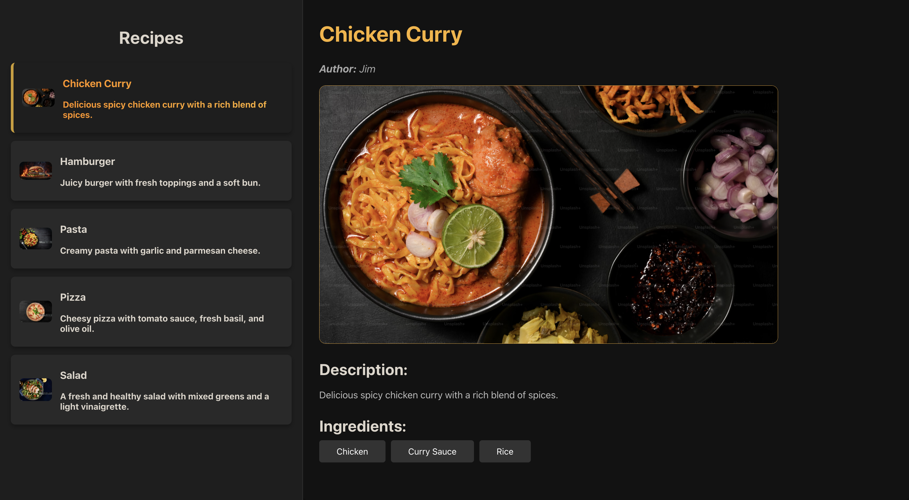
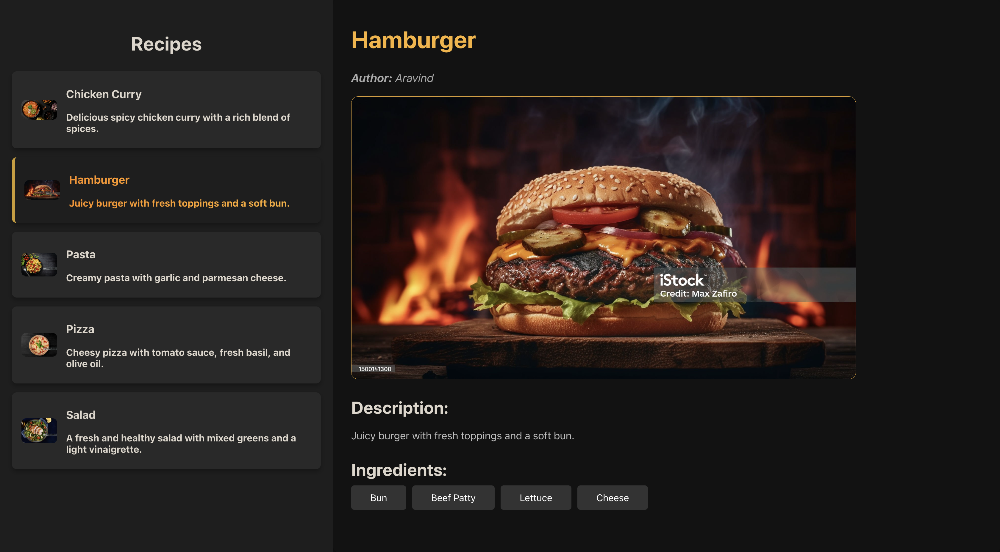

<div align="center">

  <h2>Cookbook</h2>

  <h3>
    <a href="https://cookbook-restoguru.netlify.app/">
      <strong>Demo Website</strong>
    </a>
  </h3>

  <div align="center">
    <a href="https://cookbook-restoguru.netlify.app/">View Demo</a>

  </div>

  <hr>

</div>

<!-- Brief -->
<p align="center">
The Cookbook App is a fun and user-friendly React application that lets you dive into a diverse collection of recipes. With a clean and modern interface, it's easy to navigate and find delicious recipes to try. You can get all the details you need, like descriptions, ingredients, and even who the recipe's author is, making it a great tool for both novice and experienced cooks.
</p>

<!-- Screenshot -->
<a align="center" href="https://cookbook-restoguru.netlify.app/">





</a>

## Table of contents

- [Key Features](#key-features)
- [My process](#my-process)
  - [Built with](#built-with)
  - [What I learned](#what-i-learned)
- [Installation](#installation)
- [Author](#author)

## Key Features

- Explore a wide range of recipes, from appetizers to desserts.

- View detailed recipe information, including author, description, and ingredients.

- Clean, modern UI that's easy to navigate.

- Responsive design for use on any device.

- Accessibility-focused to ensure everyone can use the app.

## My process

### Built with

- React
- JavaScript
- CSS (including CSS Grid and Flexbox)

### What I Learned

- **Efficient Component Design:** Focused on designing and implementing reusable components, ensuring a modular structure that enhances the maintainability of the app.

- **State Management with React:** Effectively used React's state management to handle dynamic content updates, keeping the UI in sync with the latest data.

- **CSS for Styling and Layouts:** Crafted a visually cohesive and responsive design using CSS, ensuring that the app looks great on all devices. Paid special attention to Flexbox and Grid layouts for a clean and structured appearance.

- **Visual Hierarchy and User Experience:** Prioritized creating a clear visual hierarchy and user-friendly interface, making it easy for users to navigate and find the recipes they're interested in.

- **Static Data Management:** Demonstrated the ability to manage and display static data, such as recipe details, effectively and efficiently.

- **Responsive Design Techniques:** Ensured the application is fully responsive, providing a seamless experience on various devices, from mobile phones to desktops.

- **UI Enhancements:** Implemented subtle UI enhancements, like hover effects and active states, to make the app more interactive and engaging.

- **Version Control Practices:** Utilized Git for version control, ensuring a smooth workflow and efficient collaboration, with a focus on clean commit messages and branch management.

Creating the Cookbook app was an enriching experience that allowed me to refine my expertise in React and UI/UX design. This project wasn't just about implementing features; it was an exercise in crafting a seamless user experience and ensuring smooth functionality across different devices. By focusing on a clean, responsive design and efficient state management, I was able to deliver a polished application that not only looks good but also performs well. This experience has reinforced my skills and affirmed my ability to tackle complex projects with a blend of creativity and technical know-how.

### Installation

- Clone this repo:

```sh
git clone https://github.com/mghally999/cookbook-test.git
```

- Install dependencies:

```sh
npm install
```

- Build command:

```sh
npm run build
```

- Live server:

```sh
npm start
```

### Author

<b>👤 Mohammed Ghally</b>

- LinkedIn - [@mghally999](https://www.linkedin.com/in/mghally999/)
- Github: [@mghally999](https://github.com/mghally999)

Feel free to contact me with any questions or feedback!
